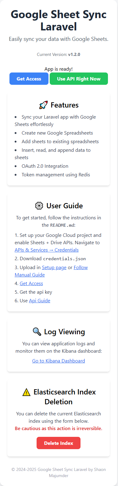
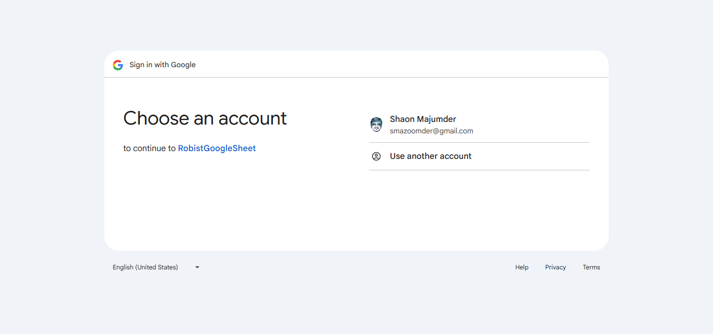
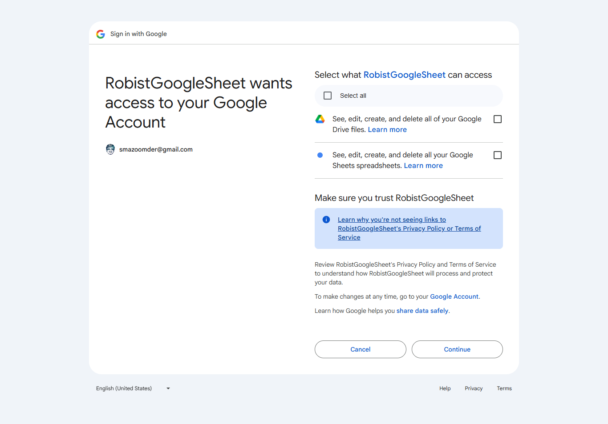
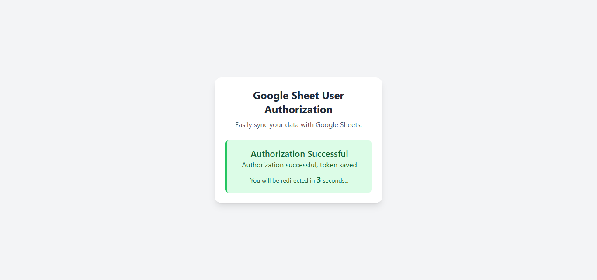

# Google Sheet Sync Laravel

> Current Version: **v1.2.0**

A Laravel-based project to interact with Google Sheets API, allowing users to create, read, update, and append data to Google Sheets directly from a Laravel application.

## 🚀 Features

-   📄 Create new Google Spreadsheets.
-   ➕ Add new sheets to existing spreadsheets.
-   🗑️ Delete entire spreadsheets or specific sheets.
-   📥 Insert or append data to specific sheets.
-   📤 Read data from Google Sheets.
-   🔍 Find a specific value in a sheet.
-   📋 List all spreadsheets and their sheets.
-   🧾 Check if a sheet exists.
-   📊 Get metadata of sheets.
-   🔐 Revoke Google OAuth access token.
-   🧹 Clear contents of a sheet without deleting it.

# Competitive Advantages

-   **Scalable** - to million users. Future - loadtest with Jmeter
-   **Secure** - API Key & Ouath 2.0, Rate Limiting, Future - JWT
-   **Efficient Token Management** - Tokens are stored in Redis, allowing for fast retrieval and improving API request performance. This leads to faster user interactions with minimal latency, enhancing overall system efficiency.
-   **Monitoring, Observilibity, Threshold Alert** - ELK Stack
-   **Faster API** - Future - GRPC for inner microservices to communicate and use it as service
-   **CI/CD** - Future - Github Actions and Jenkins

## 📚 Knowledge Stack

-   Google Sheets API
-   Docker
-   OAuth 2.0
-   Redis
-   Swagger
-   Elasticsearch + Kibana + Logstash - Adding Response Time
-   Laravel 8.x
-   PHP 7.4

## 🔮 Future Roadmap

-   Prometheus + Grafana
-   GraphQL & gRPC APIs
-   GIT webhook
-   CI/CD pipelines
-   Token-based security with JWT

## Liked Features

-   Health Check of API
-   logstash centralized - api response time

## API Best Practices Here

-   Inter API Communication
-   API Security
-   API Integration
-   Versioned APIs
-   API Documentation
-   Semantic versioning and changelog
-   Rate Limiting

## Project Details

-   **Backend Language**: PHP 7.4
-   **Framework**: Laravel Framework 8.83.29
-   **Purpose**: Synchronize data between your Laravel application and Google Sheets using Google Sheets API.

## 📸 Screenshots

<div style="display: flex; overflow-x: auto; scroll-snap-type: x mandatory; padding: 10px; gap: 10px;">

  
  
  
  

</div>

## Prerequisites

1. **Google Cloud Project**:

    - **OAuth Access**: Authenticate users via OAuth to interact with Google Sheets.
    - Create a project in the Google Cloud Console.
    - Enable the **Google Sheets API** and **Google Drive API**.
    - Create OAuth 2.0 credentials and download the `credentials.json` file.

2. **Environment Setup**:
    - Docker

## Installation

1. Clone the repository:

    ```
    git clone https://github.com/your-repo/google-sheet-sync-laravel.git
    cd google-sheet-sync-laravel
    ```

2. Install dependencies:

    ```
    docker-compose up --build
    ```

3. After application launch follow the setup guide at - http://localhost:8000/

## Development

-   update api documentaion :

    ```bash
        php artisan l5-swagger:generate
    ```

## Usage

After launching see api manual at - http://localhost:8000/api/documentation
and for brief here is the api routes :

### API Routes

Below is the list of available API routes for Google Sheet Sync:

-   `GET /access-revoke`  
    Revoke the access token.  
    `Route Name`: `revoke.access`

-   `POST /create-spreadsheet`  
    Create a new Google Spreadsheet.

-   `POST /create-sheet/{spreadsheetId}/{sheetName}`  
    Create a new sheet in the specified spreadsheet.

-   `DELETE /delete-spreadsheet/{spreadsheetId}`  
    Delete the specified Google Spreadsheet.

-   `DELETE /delete-sheet/{spreadsheetId}/{sheetName}`  
    Delete the specified sheet from the spreadsheet.

-   `GET /read-sheet/{spreadsheetId}/{sheetName}`  
    Read the data from the specified sheet in the spreadsheet.

-   `POST /insert-data/{spreadsheetId}/{sheetName}`  
    Insert data into the specified sheet of the spreadsheet.

-   `POST /append-data/{spreadsheetId}/{sheetName}`  
    Append data to the specified sheet of the spreadsheet.

-   `GET /list-spreadsheets`  
    List all available Google Spreadsheets.

-   `GET /list-sheets/{spreadsheetId}`  
    List all sheets within the specified spreadsheet.

-   `GET /sheet-exists/{spreadsheetId}/{sheetName?}`  
    Check if the specified sheet exists in the spreadsheet.

-   `POST /find-value/{spreadsheetId}/{sheetName}`  
    Find a value in the specified sheet of the spreadsheet.

-   `GET /get-sheet-metadata/{spreadsheetId}/{sheetName?}`  
    Retrieve metadata for the specified sheet in the spreadsheet.

-   `GET /clear-sheet/{spreadsheetId}/{sheetName?}`  
    Clear the data of the specified sheet in the spreadsheet.

## Key Classes

### GoogleSheetHelper

This service class handles interactions with the Google Sheets API. It includes methods such as:

-   `createSpreadsheet($title, $data = null)`
-   `createSheet($sheetName)`
-   `insertData($sheetName, $data)`
-   `readSheet($sheetName)`
-   `appendRow($rowData, $sheetName)`

### Example Usage

```
$googleSheetHelper = new GoogleSheetHelper();

// Create a new spreadsheet
$spreadsheetId = $googleSheetHelper->createSpreadsheet('Sample Spreadsheet');

// Add a new sheet
$sheetId = $googleSheetHelper->createSheet('Sample Sheet');

// Insert data
$data = [
    ['Name', 'Age', 'City'],
    ['Alice', '30', 'New York']
];
$googleSheetHelper->insertData('Sample Sheet', $data);

// Read data
$data = $googleSheetHelper->readSheet('Sample Sheet');
print_r($data);

// Append a row
$newRow = ['Bob', '25', 'Los Angeles'];
$googleSheetHelper->appendRow($newRow, 'Sample Sheet');
```

### Auth Response

```json
$accessToken = $client->fetchAccessTokenWithAuthCode($authCode);
             // Example : $accessToken
             // array:6 [▼
             //     "access_token" => "ya29.a0ARW5m74hIjmOX3v6xxtK_u6HTDEeqCreYEzF-yAmeXItvTa1F3-n3KCcGF1seh9kru9eGE3-GL3JDe4gd2Ns8F2hUOYiEjCN4cauvBsjTX9grYeVxgpJNKLL8LCh9j1Z6B5kg6zdxDs-XgRv5gAfTOcAg ▶"
             //     "expires_in" => 3599
             //     "refresh_token" => "1//0gnUMZXXKgU-KCgYIARAAGBASNwF-L9Irq-ZsM5gXDlXf2SbCvP_-6uqNebKkIeTmxIQzmO0C3MHyM3rIQuSPlS1oXNPp2mh_QJY"
             //     "scope" => "https://www.googleapis.com/auth/spreadsheets"
             //     "token_type" => "Bearer"
             //     "created" => 1737240385
             // ]


// $client->setRedirectUri('http://localhost:8000/sheet/oauth/callback');
```

### Log Handling

-   Adding Response Time
-   general logging -

```php
Log::channel('elasticsearch')->error('Access Denied.', [
                'status' => false,
                'httpStatusCode' => 403,
                'error' => "To get access visit $hostWithPort to in browser.",
                'request' => $request->all(),
                'requestMethod' => $request->method(),
                'requestUrl' => $request->url(),
                'requestIp' => $request->ip(),
                'requestUserAgent' => $request->userAgent()
            ]);

// or,
// for automatic api response time
LogstashAttributeHelper::setAttributes($request, [
                'logMessage' => 'Spreadsheet created successfully',
                'logContext' => [
                    'status' => true,
                    'message' => 'Spreadsheet created successfully',
                    'spreadsheetId' => $spreadsheetId,
                    'link' => "https://docs.google.com/spreadsheets/d/$spreadsheetId"
                ]
            ]);
```

To see logstash works

http://localhost:5601/app/dev_tools#/console
GET /googlesheet-api-index-\*/\_search
{
"query": {
"match_all": {}
}
}

Log delete -

```bash
curl -X DELETE "http://localhost:9200/googlesheet-api-index-2025-05-06"
```

# Visualization

filters Dashboard to isolate errors (e.g., status >= 400).
Dashboard panel for error spikes (like 500s).
Alert rule in Kibana for unusual spikes in 500/400 errors.
http://localhost:5601/

### LoadTest

### UnitTest

## Troubleshooting

### Clear and cache configurations:

      ```
      php artisan config:clear
      php artisan cache:clear
      php artisan config:cache
      ```

### Removing Accidental Credential File from Git History

      1. **Backup Your Repository**
         Before making any changes, ensure you have a backup of your repository.

      2. **Run Git Filter-Branch to Remove the File**
         Use the following command to remove the credentials file from all commits in the repository's history:
         ```bash
         git filter-branch --force --index-filter \
         "git rm --cached --ignore-unmatch storage/client_secret_*.json" \
         --prune-empty --tag-name-filter cat -- --all
         ```

      3. **Remove Refs to Original History**
         Clean up any refs that Git may have created during the filter-branch operation:
         ```bash
         rm -rf .git/refs/original/
         ```
      4. **Expire the Reflog and Garbage Collect**
         This will remove the old, now unreachable history:
         ```bash
         git reflog expire --expire=now --all
         git gc --prune=now --aggressive
         ```

      5. **Force Push the Clean History to the Remote**
         Finally, force-push the cleaned history and tags to the remote repository:
         ```bash
         git push origin --force --all
         git push origin --force --tags
         ```

### Updating .env values in docker

      1. see existing .env file in container -
         ```bash
         docker compose exec app cat .env
         ```

      2. change in .env locally

      3. copy .env into docker container -
         ```bash
         docker cp .env googlesheet-laravel-app:/var/www/html/.env
         ```

      4. config .env update inside docker container -
         ```bash
         docker compose exec app php artisan config:clear
         ```

### **Redis Issues**

If you encounter issues with Redis, follow these steps:

-   Install `php-redis`:

    ```bash
    sudo apt-get install php-redis
    ```

-   Ensure Redis is running and accessible by the application.

### 2. **Docker and Redis Connection**

      **RedisException - Connection refused**
      - Set up token storage: Ensure you have a Redis server running and update .env:

         REDIS_HOST=127.0.0.1
         REDIS_PASSWORD=null
         REDIS_PORT=6379

         - if you are using docker,
         REDIS_HOST=redis
         REDIS_PASSWORD=null
         REDIS_PORT=6379

         here redis is container name in docker-compose.yml
         ```bash
            redis:
               image: redis:alpine
               container_name: laravel-redis
               restart: unless-stopped
         ```

      If you're using Docker, you may need to update the `REDIS_HOST` to the IP address of your Docker container. Follow these steps:

      1. Check the Docker network:

         ```bash
         ip addr show docker0
         ```

         Look for the IP address under `inet`, typically something like `172.17.0.1`.

      2. Update the `.env` file with the Docker IP:

         ```env
         REDIS_HOST=172.17.0.1
         ```

### 3. **OAuth Issues**

-   Ensure that the `credentials.json` file is properly configured and has the correct permissions.
-   Double-check the redirect URI in both the Google Cloud Console and your `.env` file.
-   If you get an expired token, the application will automatically refresh it as long as the refresh token is available.

## Common Issues

1. **Redirect URI Mismatch**: Ensure the redirect URI matches the one set in Google Cloud Console.
2. **Token Expiry**: The application automatically refreshes the token if it expires, as long as the refresh token is available.
3. **Permission Errors**: Ensure the `credentials.json` file has the correct permissions and API scopes.

## FAQ

### Semantic Versioning (SemVer)

This project adheres to [Semantic Versioning](https://semver.org/)
Stick to Semantic Versioning (SemVer), which uses the format:

```md
MAJOR.MINOR.PATCH
```

-   MAJOR: Incompatible API changes
-   MINOR: Backward-compatible functionality
-   PATCH: Backward-compatible bug fixes

For example:

```md
1.0.0 → Initial stable release
1.1.0 → New features like "append multiple rows"
1.1.1 → Fix bug in sheet name casing
2.0.0 → Break change in auth flow or data format
```

# Changelog

All notable changes to this project will be documented in this file.

The format is based on [Keep a Changelog](https://keepachangelog.com/en/1.0.0/)
and this project adheres to [Semantic Versioning](https://semver.org/).

---

## [1.2.0] - 2025-03-31

### ✨ Added

-   New methods added to SheetService.
-   Insert, append, and delete row capabilities.

---

## [1.1.0] - 2025-02-28

### ✨ Added

-   Initial versioned API structure (`/api/v1`).

### 🔄 Changed

-   Enhanced UX for authorization-related pages.

### 🛠 Fixed

-   Applied cache strategy to ensure uniqueness.

---

## [1.0.1] - 2025-02-08

### ✨ Added

-   Support for reading JWT access-token from `HttpOnly` cookies.

---

## [1.0.0] - 2025-01-20

### 🎉 Initial Release

-   Basic Google Sheets integration (`createSheet`, `createSpreadsheet`).
-   Core syncing logic implemented.
-   Project structure initialized and library improvements made.

### Commit

```bash
git log --pretty=format:"-%h - %s (%an, %ad)" --date=short
```

-3f0d2f8 - docs: update README for v1.2.0 release (Shaon Majumder, 2025-04-24)
-f9aa041 - docs: update README for v1.2.0 release (Shaon Majumder, 2025-04-24)
-da7b531 - docs: update README for v1.2.0 release (Shaon Majumder, 2025-04-24)
-d1fade9 - Added new methods (Shaon Majumder, 2025-03-31)
-e99664e - method added insert append delete (Shaon Majumder, 2025-03-31)
-ba303f2 - api v1 (Shaon Majumder, 2025-02-28)
-f4c4b84 - authorization pages better ux (Shaon Majumder, 2025-02-28)
-98bc318 - api (Shaon Majumder, 2025-02-28)
-0314d43 - Make the cache application unique (Shaon Majumder, 2025-02-28)
-5bb1da6 - get access-token from httpCookie (Shaon Majumder, 2025-02-08)
-f6a3d4a - createSheet and createSpreadsheet (Shaon Majumder, 2025-01-20)
-0173470 - Improving the library (Shaon Majumder, 2025-01-19)

## Contributing

Feel free to fork the repository and submit pull requests.

## License

This project is licensed under the MIT License.

## Author

Shaon Majumder
smazoomder@gmail.com
